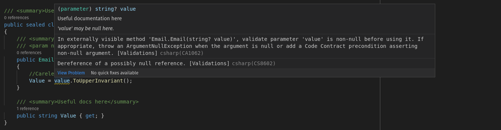

# Triplex #
[](https://www.nuget.org/packages/Triplex.Validations/)

Validation library inspired by the concepts of ***Secure by Design***, by Dan Bergh Johnsson, Daniel Deogun, and Daniel Sawano (MEAP 2019 Manning Publications). (Preconditions, Postconditions, Invariants & Proto-Primitives at [https://docs.microsoft.com/en-us/dotnet/framework/debug-trace-profile/code-contracts](https://docs.microsoft.com/en-us/dotnet/framework/debug-trace-profile/code-contracts "C# Code Contracts"))

## Project's Code Health ##
### Overall ###
[](https://sonarcloud.io/dashboard?id=lsolano_triplex)

### Ratings ###
[](https://sonarcloud.io/dashboard?id=lsolano_triplex) [](https://sonarcloud.io/dashboard?id=lsolano_triplex) [](https://sonarcloud.io/dashboard?id=lsolano_triplex) 
[](https://sonarcloud.io/dashboard?id=lsolano_triplex)

## Types of validations ##
### Arguments ###
Remember that arguments are actual values to methods declared parameters. The utility class used to validate arguments is `Triplex.Validations.Arguments`. If an argument is invalid this utility will throw an `System.ArgumentException` or one of its derivatives.

### Object's state ###
Sometimes we need to check internal state before or after certain operation to ensure preconditions and invariants respectively. To check for those we use `Triplex.Validation.State` utility. This one throws `System.InvalidOperationException` or one of its derivatives.

---

## Motivations ##
* Do reject bad input as soon as possible specially `null`s.
* Control data coming from public interfaces.
* Help API creators to enforce code contracts.
* Remove compiler warnings around `null` checks.

## Design ##
For arguments, all checks imply a `null` check first. So if you see something like `_value = Arguments.OrException(value);`
means "return the exact same value or throw an exception if it is `null`". By the same logic, `Arguments.LessThan(value, other);`
means "return the exact same value if is less than `other` otherwise throw an exception, but if some argument value is 
`null` throw  `ArgumentNullException`.


## Examples
### Removing Compiler Warnings ###
1. Simle `Email` wrapper class with Warning


*(Fig. 01 - `Email` class showing warning)*



*(Fig. 02 - `Email` class showing expanded warning)*

2. Same issue even when we declare argument as "non-nullable" `string` instead of `string?`


*(Fig. 03 - `Email` class showing even with non-null reference type)*

3. Removing warning using `Arguments.OrException(value)`


*(Fig. 04 - Issue solved using block style)*


*(Fig. 05 - Issue solved using expression-method style)*

### Arguments ###
```csharp
using Triplex.Validations;

public sealed class Email
{
	private readonly string _value;

	public Email(string value)
	{
		//a) Simple form (param name for ArgumentException is automatically taken from 1st parameter)
		Arguments.OrException(value);
		
		//b) With custom message (param name for ArgumentException is automatically taken from 1st parameter)
		Arguments.OrExceptionWithMessage(value, "Invalid email");
		
		// Use value ensuring that it is not null now
		_value = value.ToLowerInvariant();

		// or use returned value from argument check 
		_value = Arguments.OrException(value); //return same input (literally same reference) 
	}

	// Collapse Check-Then-Assign pattern using returned value from checks.
	public Email(string username, string domain)
		=> _value = $"{Arguments.OrException(username)}@{Arguments.OrException(domain)}";	
}
```

All checks has two forms:

1. Data and ***inferred*** argument name. Like `Arguments.OrException(someArg);`
2. Data, custom message, and ***inferred*** argument name. Like `Arguments.OrExceptionWithMessage(someArg, "Your custom exception message goes here");`

If you need to use a different argument name, both forms support a last optional parameter:

1. `Arguments.OrException(someArg, "manualArgumentName");`
2. `Arguments.OrExceptionWithMessage(someArg, "Custom ex. message", "manualArgumentName");`

**It is not required to use `nameof(someArg)`** the following forms are equivalent
1. `Arguments.OrException(someArg);` ≡ `Arguments.OrException(someArg, nameof(someArg));`
2. `Arguments.OrExceptionWithMessage(someArg, "Custom ex. message");` ≡ `Arguments.OrExceptionWithMessage(someArg, "Custom ex. message", nameof(someArg));`

### Object's state ###
```csharp
using Triplex.Validations;

public sealed class MyList<T>
{
	public T Remove(int index) {
		//0. Pre-condition
		State.IsTrue(_size > 0, "Unable to remove elements when empty.");

		//1. Contract
		Arguments.Between(index, 0, _size - 1, "Index out of bounds.");

		//2. Do your stuff
		T removed = DoRemoveElementAt(index);
		
		//3. After removing size must be zero or greater
		State.StillHolds(_size >= 0, "Internal error, size must not be negative.");

		return removed;
	}
}
```
State checks semantics:

1. Preconditions: `Is*(expression)` where `expression` depends on the actual check. Could be `boolean` or just a value (like in `State.IsNotNull(value)`).
2. Postconditions: `Still*(expression)` where expression depends on the actual check. Could be `boolean` or just a value.

There is no argument name, because `State` is used to validate objects internal state, as a hole, or invariants.

## Contribute
We like to get help from everybody, if you want to contribute to this tool, found some issue or just want a feature request please read, first, the [Contributing guide](./docs/CONTRIBUTING.md).

### Where to start?
1. Fork + Clone this repo
2. Build and Run Tests locally
    1. Build only `dotnet build`
    2. Full clean, build and test `dotnet clean && dotnet test /p:CollectCoverage=true`
3. Incremental build and test (regular dev workflow)
    1. `dotnet test /p:CollectCoverage=true`

At the end of a test run you should see something like 
```sh
Calculating coverage result...
  Generating report '~/tests/unit/Validations.Tests/coverage.net6.0.json'

+---------------------+------+--------+--------+
| Module              | Line | Branch | Method |
+---------------------+------+--------+--------+
| Triplex.Validations | 100% | 100%   | 100%   |
+---------------------+------+--------+--------+

+---------+------+--------+--------+
|         | Line | Branch | Method |
+---------+------+--------+--------+
| Total   | 100% | 100%   | 100%   |
+---------+------+--------+--------+
| Average | 100% | 100%   | 100%   |
+---------+------+--------+--------+
```	
You should maintain a 100% of test coverage, please do not submit Pull Requests if you are unable to do that. If you need help, or does not know how to achieve the expected coverage percentage please contact maintainers for advice. 
